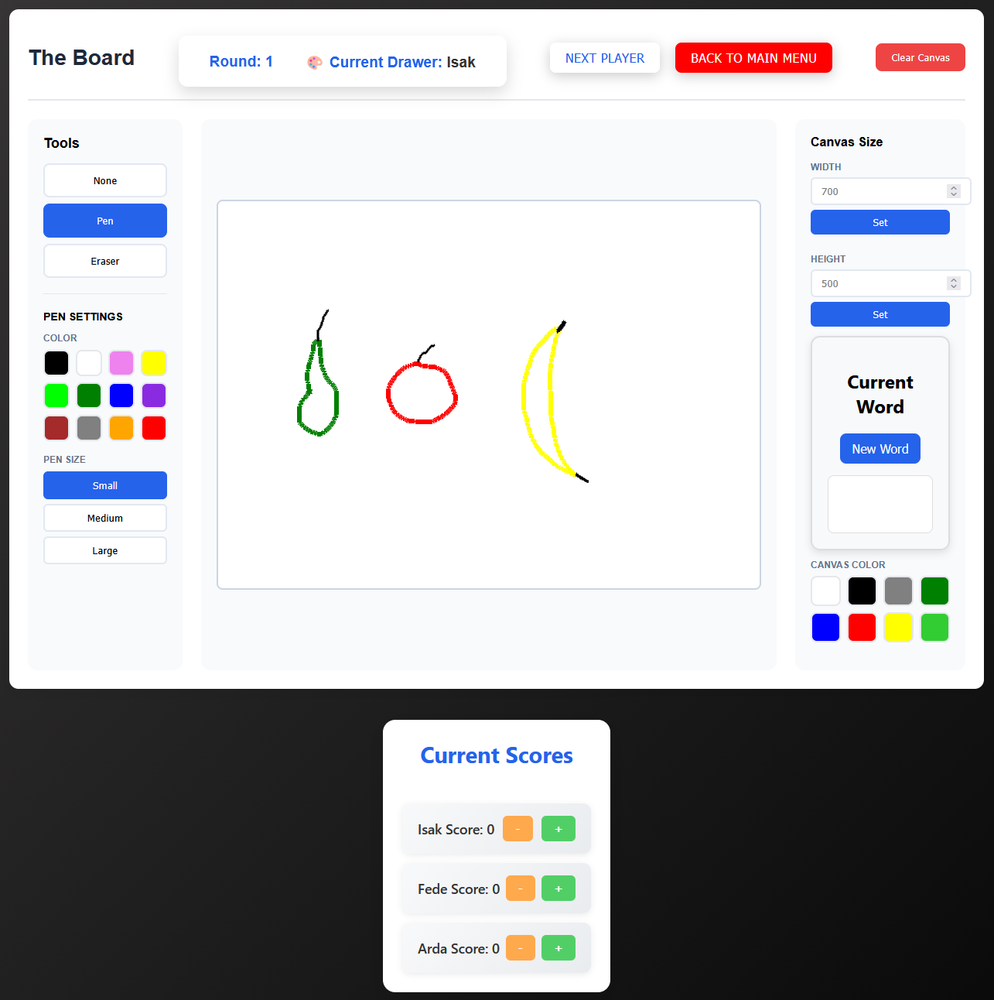

# Drawing Game Application
This is an application (L3) that was made as part of the 1dv610 course at LNU university in Kalmar, The application itself is a multiplayer drawing game built with Web Components and vanilla JavaScript. Players take turns drawing words while keeping track of scores in this engaging and interactive browser-based game. Built on top of the custom my-board drawing module, this application demonstrates clean code principles and modular architecture.

## Features

1. Multiplayer Support: 2-4 players can compete in the same game
2. Turn-Based Gameplay: Automatic turn rotation with visual indicators
3. Score Tracking: Real-time score updates with automatic win detection
4. Word Generation: Random word prompts for each drawing round
5. Interactive Canvas: Full-featured drawing board with colors and pen sizes
6. Player Management: Add, remove, and manage players dynamically
7. Leaderboard System: Track scores throughout the game
8. Zero Dependencies: Pure vanilla JavaScript implementation

## Demo



## Access the application here
https://assignmentl3.netlify.app/

## Game Rules

1. Setup Phase:
- Add **2-4 players** using the player input field
- Press **"Start Game"** when ready

2. Gameplay:
- The current drawer sees a random word at the right of the canvas
- Hover over the hidden word (only the drawer should see it)
- Draw the word using the canvas tools
- Other players try to guess what's being drawn
- Press "Next Player" to rotate turns

3. Scoring:
- Use the + and - buttons to adjust player scores
- Player gets a point for every correct guess
- First player to reach 4 points wins
- Scores reset after each game

4. Navigation:
- "Back to Main Menu" returns to the start screen
- Players are preserved when returning to menu but scores are cleared

## Components
### Drawing Game `(drawing-game)`
- Main application component that orchestrates game flow and manages child components.

#### Key Features:
- State management
- Turn rotation logic
- Win condition detection
- Component coordination

### Player Manager `(player-manager)`
- Handles player registration, score tracking, and leaderboard display.

#### Features:
- Add/remove players
- Score increment/decrement
- Automatic mode switching (add players ↔ leaderboard)
- Win event dispatching

### Word Generator `(word-generator)`
- Provides random word prompts for each drawing round.

#### Features:
- Automatic random word selection
- Word reveal on hover
- "New Word" button for manually changing words

### Start Screen `(start-screen)`
- Welcome screen with game instructions.

#### Features:
- Game description
- Player requirements information
- Start game trigger

### Drawing Board `(my-board)`
- Custom canvas component for drawing (L2 module).

#### Features:
- Pen tool with multiple colors
- Eraser tool
- Canvas size configuration
- Clear canvas functionality


### File Structure

```js
project-root/
├── src/
│   ├── components/
│   │   ├── drawingGame/
│   │   │   ├── drawingGame.js              # Main game component
│   │   │   └── drawingGame-template.js     # Template and styles
│   │   ├── playerManager/
│   │   │   ├── playerManager.js            # Player management logic
│   │   │   └── playerManager-template.js   # Player UI template
│   │   ├── wordGenerator/
│   │   │   ├── wordGenerator.js            # Word generation logic
│   │   │   ├── wordList.js                 # Word List
│   │   │   └── wordGenerator-template.js   # Word display template
│   │   └── startScreen/
│   │       ├── startScreen.js              # Start screen component
│   │       └── startScreen-template.js     # Welcome screen template
│   └── js/
│       └── app.js                          # Application entry point
├── myModule/                               # L2 canvas module (external)
│   └── src/
│       └── js/
│           └── index.js                    # my-board module entry
```

### Clean Code Principles
This project was made with  the book "Clean Code" chapters 2-11 from Robert C. Martin, for a detailed analysis, see `reflection.md`

### License
This project is licensed under the MIT License. You are free to use, modify, and distribute it for personal or commercial purposes.

### Future Enhancements
- Timer for each turn
- Chat functionality for guessing
- Word categories (easy, medium, hard)
- Difficulty levels
- Save/load game state
- Sound effects and animations
- Mobile touch optimization
- Multiplayer over network
- Game statistics and history
- Custom word lists
